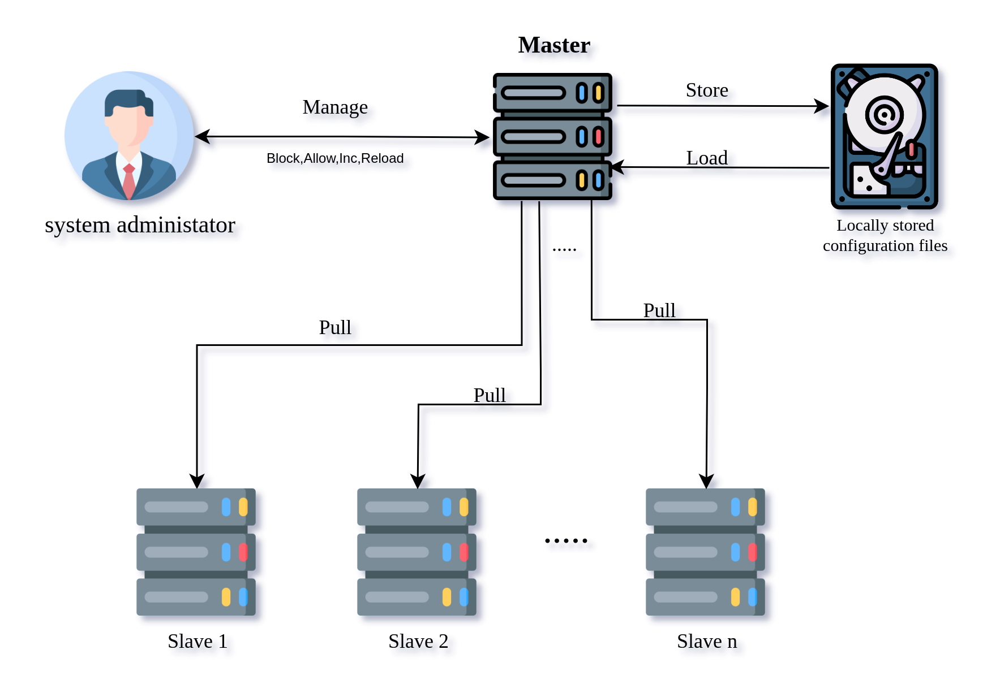

# Table of contents

[[_TOC_]]

# Introduction

GoXDP is a simple and powerful XDP filter with kernel-space code built with C and user-space code built with Golang that utilizes the power of the longest prefix matching (LPM) algorithm to filter subnets and IP addresses with predefined timeouts. Also, interacting with GoXDP can be through the RestfulAPI or the CLI client commands. <br>
{width=70%}

# Quick Start

## Quick Start for GoXDP on Docker

`docker run -d --network host --name goxdp --privileged --restart always ahsifer/goxdp:2.1 server -privateIP=127.0.0.1`

## Quick Start for GoXDP binary

- Download the latest binary from https://git.elcld.net/e_ahsifer/goxdp/-/releases.
- Run `goxdp server -privateIP=127.0.0.1` to start goxdp service.

# GoXDP service

The following include the available command line arguments and their description when starting a new GoXDP service:

```
./goxdp server -h
Usage of server:
  -privateIP string
    	The private IP address the service will listen to, that will be used to respond to load,unload,block,allow, and status requests (default "127.0.0.1")
  -privatePort string
    	The private Port number the service will listen to (default "8090")
  -publicIP string
    	The public IP address the service will listen to that will be used to respond to metrics and status requests (default "127.0.0.1")
  -publicPort string
    	The public Port number the service will listen to (default "8091")
  -timeoutInterval int
    	The timeout interval of the worker thread to check if subnet or IP address timeout is finished (default 30)
  -master
    	Enable master-slave communication
  -masterIP string
    	The IP address of the master service (default "127.0.0.1")
  -masterPort string
    	The port number that the master service is listening to (default "9999")
  -protocol string
    	use http or https to communicate with the master (default "http")
  -validSSL
    	Enable when the master uses valid SSL certificate (useful when the chosen protocol is https)
  -masterPullInterval int
    	The timeout interval between checking for updates from the master (default 5)

```

# GoXDP Master Service

As the number of goxdp instances increases, The effort needed and complexity to manage them increases. Therefore, We introduce the Master-Slave communication where a single node acts as a master and multiple goxdp slaves are connected to it. Furthermore, all the block and unblock operations will be managed from a single master node. The following diagram describes the cluster setup. <br>

<!-- {width=70%} -->
<p align="center">
  
</p>

# GoXDP Client

Two different approaches can be followed to interact with XDP: <br />
1- Using GoXDP CLI client <br />
2- Using RestFul API <br />

## GoXDP CLI Client

The first approach introduces the GoXDP client CLI commands to perform load, unload, block, unblock, and status operations. The available arguments are:

```
./goxdp client -h
Usage of client:
  -action string
    	Available values are load,unload,block, allow, status (Also incremental and reload can be used with the master service)
  -dstIP string
    	The IP address that the goxdp service is listening to (default "127.0.0.1")
  -dstPort string
    	The Port that the goxdp service is listening to (default "8090")
  -flush
    	Passed alongside with the actions status,block,allow to flush the status or blocked IP addresses or subnets tables
  -interfaces string
    	Interfaces names that the XDP programme will be loaded to (Example 'eth0,eth1')
  -mode string
    	The mode that XDP programme will be loaded (available modes are nv,skb, and hw)
  -src string
    	src IP address or subnet that will be blocked or allowed
  -timeout uint
    	How long the IP address or the subnet will be blocked in seconds
  -master
    	Destination host is a master or not (default false)
  -protocol string
    	use http or https (Useful when the master service using HTTPS) (default "http")
  -validSSL
    	Validate destination certificate when protocol parameter is true (Useful when the master service is using valid certificate) (default false)
  -username string
    	Used for authentication purposes when contacting the master service
  -token string
    	Used for authentication purposes when contacting the master service
```

## CLI Operations:

> Note: all the following operations can be used with the master service only the following parameters needs to be added <br>
> 1- master <br>
> 2- protocol <br>
> 3- validSSl <br>
> 4- username <br>
> 5- token <br>

> Note: Only the load and unload cannot be used with the master service

### 1- Load XDP filter to interface <br />

Load the XDP filter to a single interface

```
goxdp client --action=load --interfaces=eth0 --mode=skb --dstIP=127.0.0.1 --dstPort=8090
```

Load XDP filter to multiple interfaces

```
goxdp client --action=load --interfaces=eth0,eth1 --mode=skb --dstIP=127.0.0.1 --dstPort=8090
```

### 2- Unload the filter from the interface<br />

Unload the XDP filter from a single interface

```
goxdp client --action=unload --interfaces=eth0 --dstIP=127.0.0.1 --dstPort=8090
```

Unload the XDP filter from multiple interfaces

```
goxdp client --action=unload --interfaces=eth0,eth1 --dstIP=127.0.0.1 --dstPort=8090
```

Unload the XDP filter from all the interfaces

```
goxdp client --action=unload --interfaces=all --dstIP=127.0.0.1 --dstPort=8090
```

### 3- block an IP address or subnet

block 10.4.4.0/24 for 100 seconds

```
goxdp client --action=block --src=10.4.4.0/24 --timeout=100 --dstIP=127.0.0.1 --dstPort=8090
```

block 10.4.4.0/24 forever

```
goxdp client --action=block --src=10.4.4.0/24 --timeout=0 --dstIP=127.0.0.1 --dstPort=8090
```

> Note: You can block a single IP address by passing 10.4.4.4 or 10.4.4.4/32.

<br />

> Note: Blocking the same IP address or subnet more than once just changes the timeout value.

### 4- unblock an IP address or subnet

```
goxdp client --action=allow --src=10.4.4.0/24 --dstIP=127.0.0.1 --dstPort=8090
```

### 5- unblock all the IP addresses and subnets

```
goxdp client --action=block --flush --dstIP=127.0.0.1 --dstPort=8090
```

### 6- Show status

```
goxdp client --action=status --dstIP=127.0.0.1 --dstPort=8090
```

or

```
goxdp client --action=status --dstIP=127.0.0.1 --dstPort=8091
```

### 7- empty status table

```
goxdp client --action=status --flush --dstIP=127.0.0.1 --dstPort=8090
```

### 8- Increase master's pull counter

```
goxdp client --action=increment --dstPort=9999 --master=true --protocol=https --validSSL=false --username=test --token=test
```

### 9- Reload master's configuration files (reread internal.json, blocked.list, and auth.json)

```
goxdp client --action=reload --dstPort=9999 --master=true --protocol=https --validSSL=false --username=test --token=test
```

## RestFull API Client

> Note: all the following http requests can be used with the master service (except for load and unload) only the following two headers needs to be added <br>
> 1- username <br>
> 2- token <br>

### 1- POST: Load XDP filter to interface

```
curl -X POST http://127.0.0.1:8090/load -d '{"interfaces":"eth0","mode":"skb"}'
```

### 2- POST: Unload XDP filter

```
curl -X POST http://127.0.0.1:8090/unload -d '{"interfaces":"eth0"}'
```

### 3- POST: Block an IP address or subnet

```
curl -X POST http://127.0.0.1:8090/block -d '{"src":"127.0.0.2/32","action":"block","timeout":500}'
```

### 4- POST: Unblock an IP address or subnet

```
curl -X POST http://127.0.0.1:8090/block -d '{"src":"127.0.0.2/32","action":"allow","timeout":500}'
```

### 5- POST: Unblock all the IP addresses and subnets

```
curl -X POST http://127.0.0.1:8090/flushblocked
```

### 6- GET: show status

```
curl -X GET http://127.0.0.1:8090/status | jq .
```

or

```
curl -X GET http://127.0.0.1:8091/status | jq .
```

### 7- POST: empty status table

```
curl -X GET http://127.0.0.1:8090/flushstatus
```

### 8- POST: Increment master's pull counter

```
curl -X POST -k --header "username:test" --header "token:test" https://127.0.0.1:9999/increment
```

### 9- POST: reload master's configuration

```
curl -X GET http://127.0.0.1:8090/flushstatus
```

# Metrics

The following endpoint is used to fetch metrics about the GoXDP service

```
curl -X GET http://127.0.0.1:8091/metrics
```
